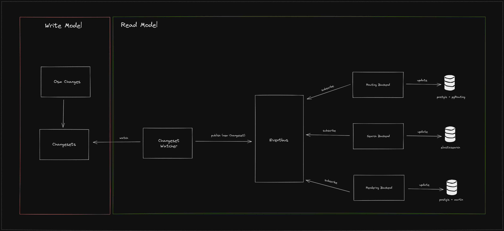

# Optimierung der Datenbanken
Um die Datenbanken zu optimieren, ist es sinnvoll, nur für den jeweiligen Anwendungszweck (Suche, Routing oder Rendering)
relevante OSM-Elemente zu speichern. OSM kennt `Nodes`(Knoten), `Ways`(Linien) und `Relations`(Relationen). Linien verweisen auf mehrere Knoten.
Ein Sonderfall ergibt sich, wenn der Startknoten einer Linie dem Endknoten entspricht, sodass sich eine Fläche ergibt.

## Search-Backend
Für die Adresssuche sind POIs und Gebäude interessant. Übernommen in die Datenbank sollten daher:
1. `Nodes`, `Wege` und `Flächen` mit den Tags `tourism` und `name`
2. `Nodes` und `Flächen` mit den Tags `building` und `name` 
3. `Nodes` und `Flächen` mit den Tags `building` und `addr`
4. `Nodes` und `Flächen` mit den Tags `amenity`und `name`

## Routing-Backend
Für die Routing-Datenbank ist es sinnvoll, nicht alle OSM-Elemente zu speichern.
Da die Adresssuche bereits durch das [Search-Backend](./Databases.md#search-backend) übernommen wird,
müssen nicht einmal POIs oder Häuser in der Datenbank gespeichert werden. Die Datenbank kann daher (und sollte) nur 
Straßen und Wege enthalten.

Die entsprechende Routing-Library bekommt als Start und Ziel jeweils durch das [Search-Backend](./Databases.md#search-backend)
ermittelte Koordinaten übergeben.

### Straßen und Wege in OSM

Straßen und Wege werden in OSM als Linien, also `Ways` dargestellt. Daher sollten grundsätzlich nur die Linien inklusive
der entsprechenden Knoten in die Datenbank gespeichert werden. Jedoch handelt es sich nicht bei jeder Linie um eine für 
das Routing relevanten Weg oder Straße.

Straßen und Wege enthalten den Tag `highway`. Für viele Straßen ist in OSM ist eine Nutzungsart eingetragen 
(z.B. `highway=motorway` oder `highway=footway`). Um die Datenbank zu optimieren, ist es sinnvoll festzulegen, für wen 
das Routing angeboten wird (z.B. Autos, Fußgänger) und nur die für die Nutzergruppe interessanten Wege in der Datenbank 
zu speichern.

> Wichtig: Alle Straßen und Wege, die den Tag `access=private` enthalten sind für das Routing grundsätzlich **nicht 
> relevant** und sollte **nicht** in der Datenbank gespeichert werden.

## Rendering-Backend
@todo